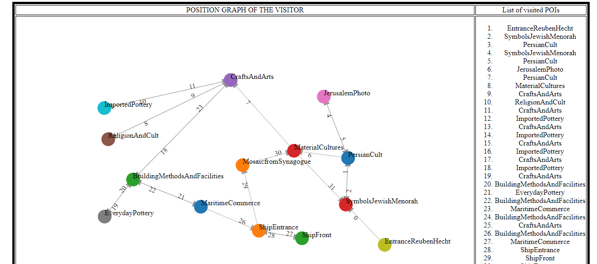
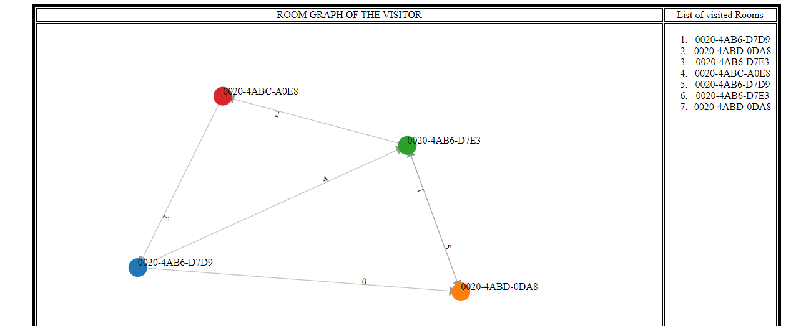

# museum-visit-summarizer
A web application which makes a user to replay his/her museum visit
## Repository Content
### Preprocessing script

### Web application
Rhe exectuable file of the web application can be downloaded [here](https://drive.google.com/file/d/1c6hdJKcqEGeAgQrlpvVt5k_Wi1UKNT_e/view?usp=sharing)

### Position Graph

### Room Graph

## Prerequisites

## Usage
### Launching the Web App
There are two ways to launch the Web App. You need to do the following two steps:
1. You can either (i) download the executable `.jar` file from [here](https://drive.google.com/file/d/1c6hdJKcqEGeAgQrlpvVt5k_Wi1UKNT_e/view?usp=sharing)
**OR** (ii) generate it using [maven](https://maven.apache.org/) by navigating inside the `acme-museum` folder and typing
the command `mvn package` to compile and create the exectuable file.
2. After you have the executable `.jar` file, navigate to the folder where the `acme-museum-1.0.0.jar` is located, open the terminal and type the command `java -jar acme-museum-1.0.0.jar`. Then, wait for the database initialization and connect your browser to `localhost:8080`.

### Launching the preprocessing script 
If you want to generate the single `data.json` file, which contains all the museum log informations organized and ready to be processed,
you need to do the following steps. 
1. Navigate to the folder wher the script `log_to_json.py` is located. 
2. Then, type the following command `python log_to_json.py <"argument1"> <"argument2"> <"argument2">`, where `argument1` is the
path of the folder where you want to locate the json file, `argument2` is the name of the json file you want to create (must end with .json) and 
`argument2` is the path to the log directory (e.g. *'Museum data/Logs/'*). 
Alternatevely, if no argument is provided the following arguments are launched by default: `python log_to_json.py 'Museum data/' 'data.json' 'Museum data/Logs/'`
